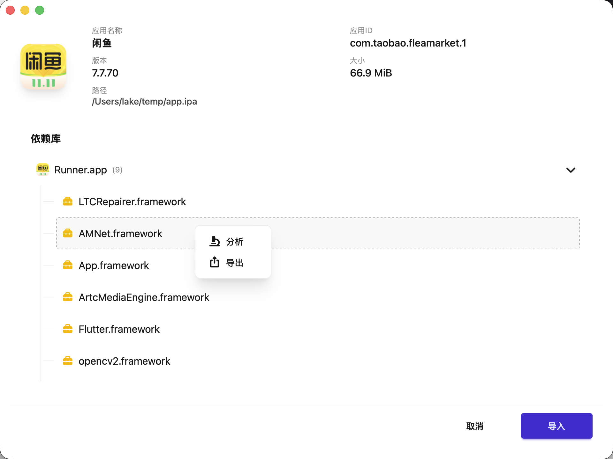
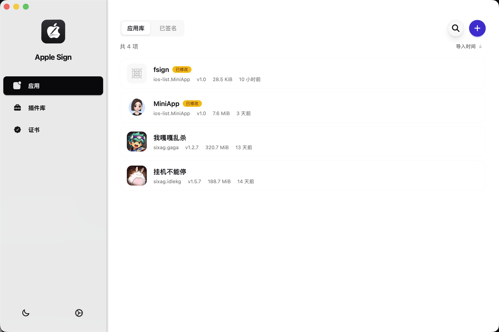
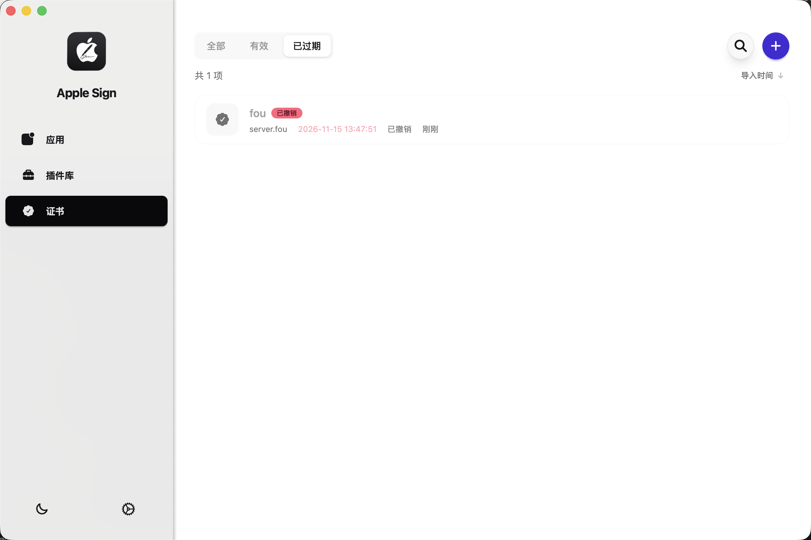
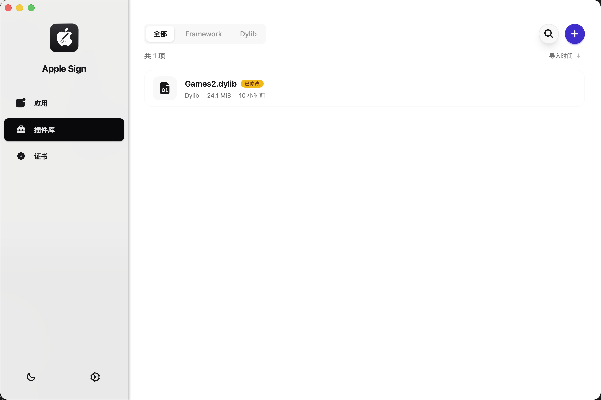
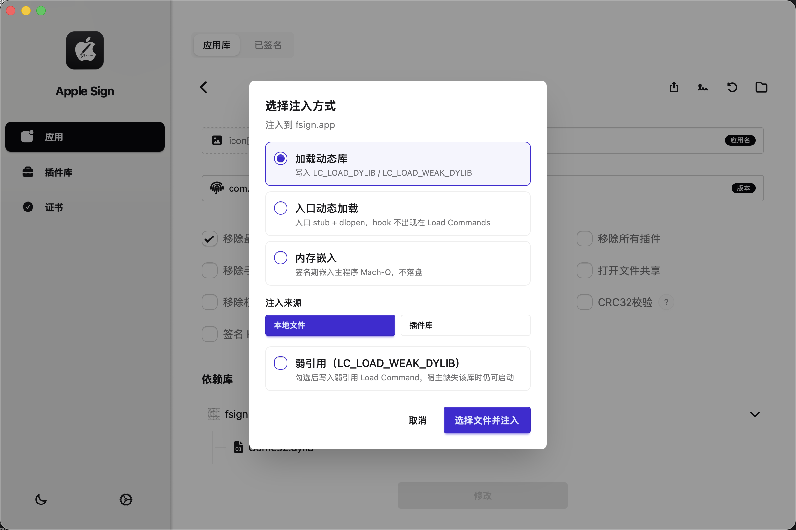
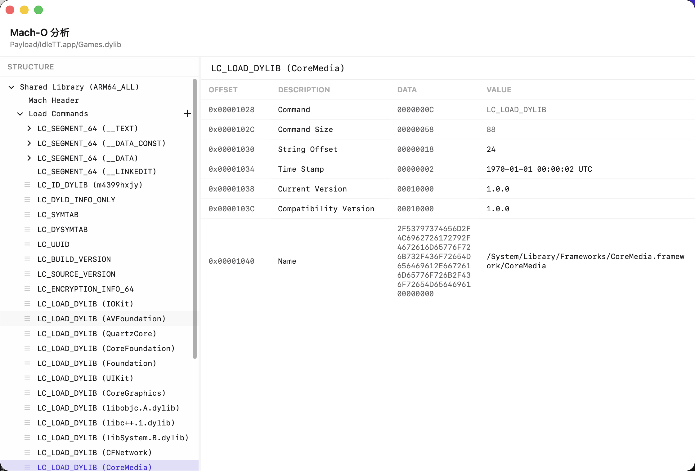
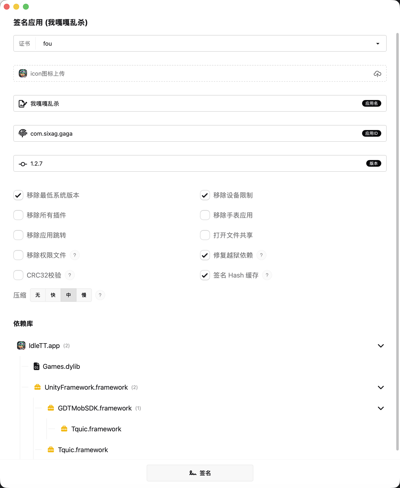
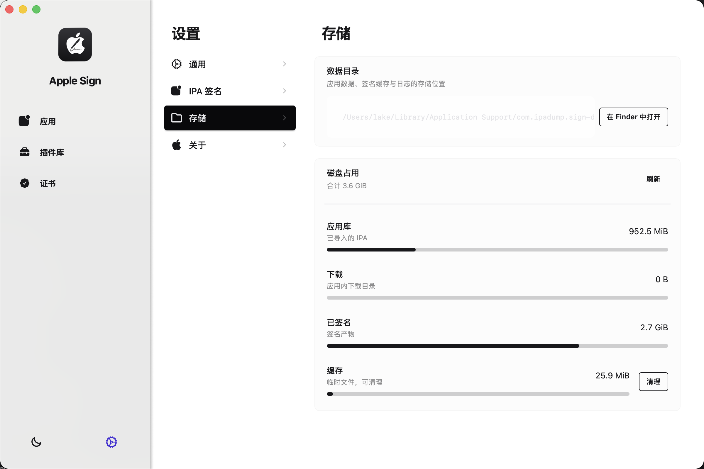

# 苹果签（Apple Sign）

面向 iOS 开发者的桌面端 **IPA 重签与证书管理工具**。跨平台支持 macOS、Windows、Linux。

完成在本地完成 IPA 解析、动态库注入、Mach-O 检视与修改、P12 证书管理，一键重签并导出或 OTA 安装到设备。

---

## 核心功能

### IPA 签名

- 导入本地 `.ipa`，预览应用名、Bundle ID、版本、图标与依赖库树
- 应用库管理：搜索、排序、编辑元数据（名称 / Bundle ID / 版本 / 图标）
- 选择 P12 证书执行重签，分阶段展示解析、注入、签名、打包进度
- 高级签名选项：移除最低系统版本、设备限制、PlugIns、Watch App、URL Schemes；开启文件共享；移除 embedded.mobileprovision；修复 CydiaSubstrate 越狱依赖路径
- 签名性能选项：CRC32 校验、Hash 缓存加速、ZIP 压缩级别（无 / 快 / 中 / 慢）
- 已签名应用管理：记录签名时间与所用证书，支持导出、OTA 安装、详情查看
- 支持流式压缩及签名，也可全使用内存，签名一个2gb的文件，使用内存不会超过20M

### 证书管理

- 导入 P12 + 描述文件 + 密码，或三合一 ZIP（`cert.p12` + `profile.mobileprovision` + `password.txt`）
- 证书列表：全部 / 有效 / 已过期筛选，支持搜索与排序
- 展示 Team ID、Bundle ID、序列号、创建与过期时间、描述文件匹配状态、吊销状态
- 解析并展示 mobileprovision 权限（Entitlements）列表
- 修改密码、重新检测、导出 ZIP / 文件夹、在 Finder 中打开、删除

### 证书过期与状态检测

- 导入时解析过期时间与描述文件匹配情况
- 自动判定：未过期、未吊销、描述文件匹配 → 有效
- 过期证书高亮显示；支持手动「重新检测」刷新状态
- 签名记录关联证书过期日，便于追溯

### 动态库管理

- 独立插件库：管理 Dylib 与 Framework，支持全部 / Framework / Dylib 筛选
- 导入本地 `.dylib`、`.framework` 或 zip，自动解析依赖树
- 重命名、编辑嵌套依赖、导出（可选连同子依赖）、删除
- 从插件库批量注入到 IPA，按依赖树逐级挂载，不拍平到 App 根目录

### 三种注入方式

| 方式 | 说明 |
|------|------|
| **加载动态库** | 向宿主 Mach-O 写入 `LC_LOAD_DYLIB` 或 `LC_LOAD_WEAK_DYLIB`，库文件落盘到 bundle；可选弱引用 |
| **入口动态加载** | 修改入口为 stub + `dlopen` 加载 hook 库，hook 不出现在 Load Commands；可选懒加载（RTLD_LAZY） |
| **内存嵌入** | 签名阶段将 hook 嵌入主程序 Mach-O，不落盘、不写 Load Command；可选要求全部架构匹配 |

注入来源：本地文件（`.dylib` / `.framework`）或插件库多选。

### Mach-O 分析

- 独立 Mach-O 检视器：树形浏览 Fat Header → 架构 → Mach Header → Load Commands → Segments → Sections
- 展示偏移、字段类型、解码值与原始十六进制
- 可编辑模式：内联 patch、新增 / 删除 Load Command（`LC_LOAD_DYLIB`、`LC_LOAD_WEAK_DYLIB`、`LC_RPATH`）、拖拽调整 LC 顺序
- 修改后自动标记变更，并提示关闭签名 Hash 缓存

### 其他能力

- **OTA 无线安装**：内置 HTTP 服务，同 Wi-Fi 下 iPhone 扫码或打开链接安装
- **应用更新**：内置 Tauri Updater，支持在线更新
- **存储管理**：查看应用库、下载、已签名、缓存占用，一键清理临时缓存
- **多平台**：macOS（Apple Silicon / Intel）、Windows、Linux

---

## 功能预览

### 导入 IPA

### 应用库

### 证书管理

### 插件库

### 动态库注入

### Mach-O 分析

### 签名

### OTA 安装

### 设置

---

## 关于本仓库

本项目基于fast-sign开源实现。

> 使用本项目或其产物软件，请遵守当地法律法规。

| 文档 | 说明 |
|------|------|
| Releases | 各平台安装包（仓库 Releases 页面下载） |
